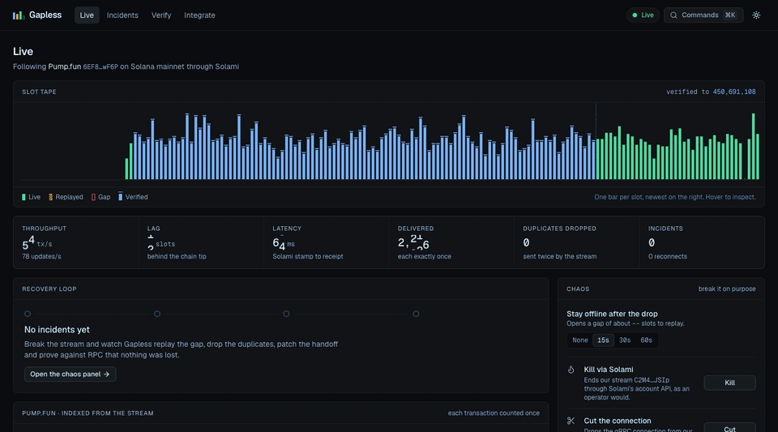
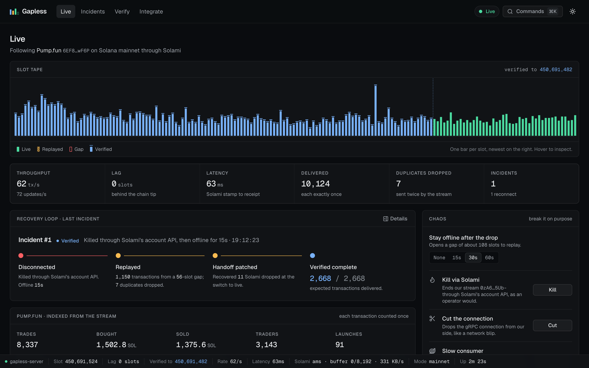
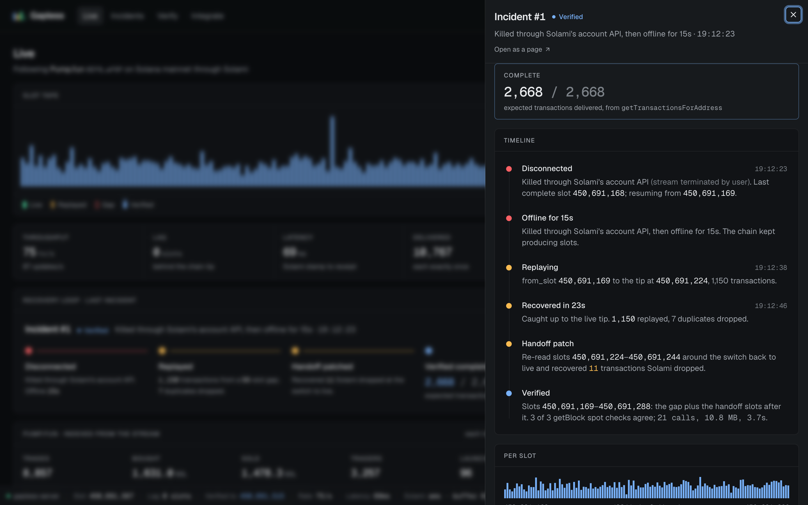
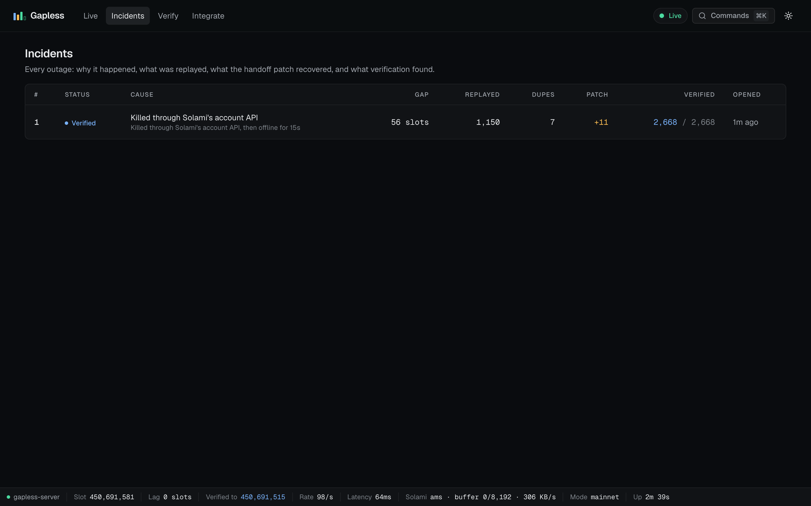
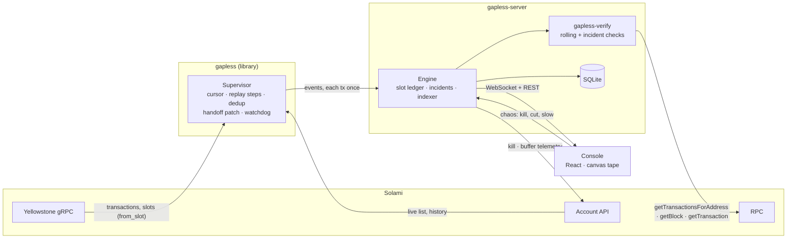

# Gapless

**Prove your Solana stream didn't miss a thing.**

[](https://github.com/vignesh-chaturvedi/gapless/actions/workflows/ci.yml)
[](LICENSE)

**[▶ Watch the 3-minute demo](https://youtu.be/LKObcNlrob0)**: three outages, live on Solana mainnet. With the handoff patch off, Solami dropped 12 transactions and only verification caught them.



Gapless is a Rust library, server and live console for [Solami](https://solami.dev)'s Yellowstone gRPC stream. When the stream drops, Gapless:

- resumes exactly where it broke, with `from_slot`
- delivers every transaction once, dropping what the resume sends again
- re-reads the slots where Solami's replay switches back to live, because Solami can drop transactions there
- checks the recovered window against RPC, transaction by transaction

The GIF above is one real outage on mainnet. The stream was killed through Solami's account API and stayed offline for 15 s. Then:

1. **Replay:** the 56-slot gap was replayed (1,150 transactions, 7 duplicates dropped).
2. **Handoff patch:** it recovered 11 transactions that Solami's resumed stream dropped at the switch back to live.
3. **Verification:** the window checked out at **2,668 of 2,668** expected transactions.

## Why

A gRPC stream will drop: an operator kills it, the consumer falls behind and the server drops it for backpressure, the network blips, a backend restarts. Yellowstone's `from_slot` lets you replay, but everything around it is left to you:

- **Where to resume.** A slot can be cut off halfway. Resume after it and you lose the rest; resume at it and you get repeats.
- **What's a repeat.** A naive consumer counts the overlap twice.
- **Whether anything is still missing.** From inside the stream you can't tell. This matters: on Solami mainnet we found that a resumed stream sometimes drops the start of the slot where it switches from replay to live. That slot still reports itself complete. Only an outside check shows it.

Gapless does those three things and shows its work. Every outage becomes an incident: why it happened, the gap, the replay steps, what the patch recovered, and a verification report you can audit.

## Quickstart (60 seconds)

```bash
git clone https://github.com/vignesh-chaturvedi/gapless && cd gapless
docker compose up
```

Open **http://localhost:8790** and press **Kill** in the chaos panel.

Compose pulls the prebuilt image (amd64 and arm64). `docker compose up --build` builds it from your checkout instead; that takes 10–20 minutes, because the Solami SDK compiles `protoc`.

Without a key it plays 150 s of recorded mainnet Pump.fun traffic, looped. The recording reproduces what Solami does: `from_slot` replay, an 8,192-message send buffer that drops slow readers, and the handoff loss. So every part of the console works offline.

### With your own Solami key

```bash
cp .env.example .env        # paste your key into SOLAMI_API_KEY
docker compose up           # now it streams Pump.fun live from Solami
```

Use a **standard API key with the Developer role**. Gapless uses it for three things:

| Solami service | What Gapless does with it |
|---|---|
| gRPC (`grpc.solami.dev`) | The transaction stream. The handoff patch opens a second stream for a few seconds after each recovery (the Pro plan allows 2) |
| Account API (`api.solami.dev`) | Identifies our stream, reads its send buffer, learns why a stream ended from the connection history, and kills it for the chaos panel |
| RPC (`rpc.solami.dev`) | `getSlot`, `getTransactionsForAddress`, `getBlock` and `getTransaction` for verification and repair |

To follow a different program, set `GAPLESS_PROGRAM` in `.env`. The console's indexer panel decodes Pump.fun only, but everything else works for any program.

### Without Docker

You need Rust (via [rustup](https://rustup.rs)), `cmake` (the Solami SDK compiles `protoc`), Node 24 and pnpm.

```bash
pnpm install && pnpm --dir console build                                           # the console, served by the server
cargo run -p gapless-server --release -- --offline fixtures/pumpfun-150s.bin.zst    # no key
cargo run -p gapless-server --release                                               # live, reads SOLAMI_API_KEY from .env
```

Then open http://localhost:8790. For console development, run `pnpm --dir console dev`, which serves on :5173 and proxies to the server.

## Configuration

| Variable | Default | |
|---|---|---|
| `SOLAMI_API_KEY` | | Required for live mode. Without it, Docker falls back to the fixture |
| `GAPLESS_PROGRAM` | Pump.fun (`6EF8…F6P`) | Program whose transactions to follow |
| `SOLAMI_GRPC_URL` | `https://grpc.solami.dev` | |
| `SOLAMI_RPC_URL` | `https://rpc.solami.dev/sol` | |
| `SOLAMI_API_URL` | `https://api.solami.dev` | |
| `GAPLESS_CONSOLE` | `console/dist` if built | Directory of the built console to serve |
| `RUST_LOG` | `gapless_server=info,gapless=info` | Log filter |
| `GAPLESS_SERVER` | `http://127.0.0.1:8790` | Where the console's dev server proxies `/api` and `/ws` |

`gapless-server` flags:

- `--offline <fixture>` plays a recorded fixture instead of Solami.
- `--listen` sets the address (default `127.0.0.1:8790`).
- `--db` sets the SQLite file for incident history (default `gapless.db`).
- `--console <dir>` sets where the built console is.
- `--horizon <slots>` shortens the replay horizon (offline only).

## Add it to your bot

```toml
[dependencies]
gapless = { git = "https://github.com/vignesh-chaturvedi/gapless" }
tokio = { version = "1", features = ["full"] }
futures = "0.3"
```

```rust
let (mut events, _control) = Gapless::builder(api_key)
    .program("6EF8rrecthR5Dkzon8Nwu78hRvfCKubJ14M5uBEwF6P")
    .build()?
    .start();

while let Some(event) = events.next().await {
    match event {
        Event::Transaction(tx) => handle(tx), // each transaction exactly once, through any outage
        Event::Recovered(i) => eprintln!("back: {} replayed, {} duplicates dropped", i.replayed, i.duplicates),
        _ => {}
    }
}
```

The complete file is [`crates/gapless/examples/bot.rs`](crates/gapless/examples/bot.rs) (`cargo run -p gapless --example bot`). [`tail.rs`](crates/gapless/examples/tail.rs) prints every event, so you can kill its stream and watch it recover.

Along with transactions, the event stream reports:

- slot completions
- state changes (connecting, replaying, live, backoff)
- disconnects, with a classified reason
- reasons resolved later from Solami's connection history
- recoveries, with the gap, replay steps, duplicates and lost slots
- handoff patches
- dropped duplicates
- metrics once a second

`Control` can cut the stream, hold it offline, throttle the consumer, toggle the handoff patch and stop.

## How it works

**Resuming.** A slot is complete when its `SlotProcessed` arrives. After a drop, Gapless resumes with `from_slot` at the lowest incomplete slot, so a slot cut off halfway is read again from its start.

Deep gaps trip Solami's backpressure mid-replay (at roughly 450 Pump.fun slots). Gapless keeps resuming from its cursor, step by step, until it's live. When the gap is older than Solami's 3,000-slot replay window (~13 minutes), it resumes a safe margin inside the window, because the window slides while the request is in transit. It reports the lost slots with their exact range.

**Exactly once.** Every signature is remembered for the replay window plus a margin (3,512 slots). Anything Solami sends again is dropped and reported as `Event::Duplicate`.

**The handoff patch.** Once the stream is 32 slots past a replay's target, Gapless opens a short second subscription from the target, re-reads 20 slots, and lets dedup pass only what the resumed stream dropped.

**Hidden closes.** A slow consumer can have its stream closed for backpressure while minutes of updates are still buffered on its own side, so the close isn't seen until they drain. Gapless watches Solami's live-connection list and ends the stream as soon as ours disappears from it. A bare end-of-stream is looked up in Solami's connection history, which often turns out to be `backpressure`.

**Verification** (`crates/gapless-verify`). It waits for slots to finalize, then rebuilds what the filter *should* have delivered and compares it with what *was* delivered:

- **Expected set:** Solami's `getTransactionsForAddress` with `filters: { slot: { gte, lte }, status: "succeeded" }`. It includes transactions that reference the program only through lookup tables (22–25% of Pump.fun's).
- **Independent check:** a few full `getBlock`s with the same filter applied by Gapless. On 20 of 20 consecutive slots the two sources agreed exactly.
- **Differences:** each one is classified as missing (with its block position and likely cause, such as the replay handoff), orphaned (a dead fork), landed in another slot, or unexplained. Missing transactions are fetched with `getTransaction`, which is how a consumer would backfill them.

The server checks every slot as it finalizes (rolling verification). It also checks each incident's gap plus the 64 slots after it, where handoff losses land.

```bash
cargo run -p gapless-verify --release -- run --secs 120 --kill-after 20 --hold 60 --out report.json
cargo run -p gapless-verify --release -- sources --slots 20      # the two ground truths, slot by slot
```

## The console



The Live page is built for watching an outage happen and get proven:

- **Slot tape:** one bar per slot. A gap shows red, replayed slots amber, and verified slots blue; a red cap on a verified bar means RPC filled in what Solami dropped. Hover to inspect a slot; click a replayed stretch to open its incident.
- **Recovery loop:** the newest incident, stage by stage: disconnected, replayed, handoff patched, verified. It shows countdowns, how long the gap stays replayable, replay progress and the final count.
- **Chaos panel:** kill the stream through Solami's API, cut it, or slow the consumer. Each needs a second press to confirm, and you choose how long to stay offline. There's also a switch for the handoff patch.
- **Solami buffer:** `buffer_pending` for our stream, with its trend and an estimate of when Solami will drop the stream.
- **Pump.fun indexer:** exact counts through every incident. Replayed transactions are hatched in the minute they happened.
- **Transactions:** live, replayed and patched transactions, plus the duplicates Gapless dropped. The list pauses while you hover.

| Incident detail | Incident history |
|---|---|
|  |  |

Press ⌘K for commands; ⇧⌘L switches between dark and light. The design direction is in [`brand.md`](brand.md).

## Chaos scenarios

Each scenario is one command against a running server. Each needs `curl` and `jq`, drives the chaos API, waits for the incident to be verified, and prints PASS or FAIL. CI runs all four against the offline fixture on every push.

| Script | What it does | Passes when |
|---|---|---|
| `scripts/scenario-a.sh` | Kills our stream through Solami's account API and stays offline 30 s | the replayed window verifies complete |
| `scripts/scenario-b.sh` | Slows the consumer until Solami's buffer fills and it drops the stream | the drop is classified as backpressure and the window verifies complete |
| `scripts/scenario-c.sh` | The twist: the same outage with the handoff patch off, then on | with it off, verification catches what Solami dropped at the handoff (and fetches it from RPC); with it on, the window verifies complete |
| `scripts/scenario-d.sh` | Stays offline past the 3,000-slot replay horizon (15 min) | the lost slots are reported with their exact range, and the recovered part verifies complete |

```bash
scripts/scenarios.sh                  # A–D, twice
HOLD=60 scripts/scenario-a.sh         # a longer outage
MINUTES=120 scripts/soak.sh soak.csv  # memory, counters and state sizes once a minute
```

Offline, run D against `gapless-server --offline fixtures/pumpfun-150s.bin.zst --horizon 200` with `HOLD=90`. The mainnet runs (all four scenarios, twice in a row, plus a 2-hour soak) are in [`docs/evidence/`](docs/evidence/).

## Architecture



| Path | What's there |
|---|---|
| `crates/gapless` | The library: supervisor, slot cursor, dedup window, disconnect classification, account API client, fixture recording and playback |
| `crates/gapless-verify` | Ground truth from RPC, diffs, reports, repair; a CLI for one-off runs |
| `crates/gapless-server` | The engine, the Pump.fun indexer, incident store, REST and WebSocket API ([`docs/api.md`](docs/api.md)), and the built console |
| `console/` | The web console (Vite, React, TypeScript, Tailwind, shadcn/ui) |
| `scripts/` | Chaos scenarios and the soak monitor |
| `fixtures/` | 150 s of recorded mainnet Pump.fun traffic (3.6 MB) |
| `tools/probe` | The Phase 0 probe used to measure Solami's behaviour |
| `tools/demo` | Films the demo on the live console with headless Chrome ([`docs/demo.md`](docs/demo.md)) |

## What we found about Solami

Measured on mainnet while building this; details and numbers are in [`docs/spike.md`](docs/spike.md):

- **A resumed stream can drop the start of one slot**, the one executing when the replay switches to live (at the target + 7 or 8). It happened on every early run and on 7 of 12 recoveries later. The handoff patch recovers it.
- **A backpressure close often arrives as a clean end-of-stream**, not the `RESOURCE_EXHAUSTED` the docs describe. Only the connection history says why.
- **A slow consumer's close can sit behind its own buffers for minutes.** The live-connection list shows it straight away.
- **The replay window slides while a subscription is in transit.** Resuming at the reported first slot fails with `OUT_OF_RANGE` a second later.
- The replay horizon is **3,000 slots** (not 3,500), and slots are **~264 ms**. A replay deeper than ~450 Pump.fun slots trips backpressure.

## Limitations

- **Completeness is relative to the filter.** Gapless verifies successful transactions that touch the followed program. Failed transactions are excluded unless you set `include_failed`.
- **Lost is lost.** An outage longer than the replay horizon (~13 minutes) loses slots. Gapless reports the exact range but doesn't backfill it; repair fetches at most 500 missing transactions per report.
- **Verification lags the stream** by finalization (~32 slots, ~10 s) and costs RPC calls. An incident window of ~400 slots takes ~20–60 calls and a few seconds.
- **State is in memory.** A server restart starts a fresh stream; the cursor and dedup window aren't persisted. Incident history is (SQLite).
- **Processed commitment sees forks.** A transaction seen first on a dead fork is delivered once, at that slot. Verification reports it as orphaned or landed elsewhere.
- **The server follows one program**, though the library takes any account filter. The indexer decodes Pump.fun only.
- **The handoff patch needs a second gRPC stream** for a few seconds, so another client on the same key can't be using it at that moment.
- **No auth on the chaos endpoints.** The server binds to localhost (and Docker publishes only to localhost). Don't expose it.
- The offline fixture is 150 s looped; offline "RPC" answers come from the fixture itself.

## Development

```bash
cargo fmt --all && cargo clippy --workspace --all-targets -- -D warnings && cargo test --workspace
pnpm --dir console lint && pnpm --dir console build
```

CI ([`.github/workflows/ci.yml`](.github/workflows/ci.yml)) runs four jobs:

- the Rust checks above
- the console checks above
- chaos scenarios A–D against the offline fixture
- `docker compose up`, followed by a smoke test and scenario A against the container

If `cargo` resolves to a Homebrew install, put rustup's first (`export PATH="$HOME/.cargo/bin:$PATH"`) so `rust-toolchain.toml` applies.

## License

MIT. See [LICENSE](LICENSE).
